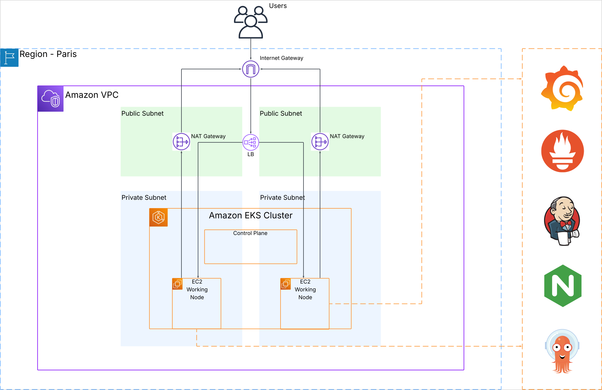

# EKS Scalable DevOps Platform

A complete DevOps platform on AWS EKS with GitOps, monitoring, and CI/CD.

**Note: This project is still under active development. The README and documentation may not reflect the most current state of the project.**


## Features

1. EKS Cluster with private nodes and autoscaling
2. GitOps with ArgoCD for automated deployments
3. Monitoring with Prometheus and Grafana
4. CI/CD with Jenkins
5. Ingress with NGINX and SSL termination
6. Security with private API and controlled access

## Architecture Overview

A high-level overview of the architecture:

 

The platform consists of the following components:

### Infrastructure Layer

- **Amazon EKS**: Managed Kubernetes cluster with private worker nodes
- **VPC with Public/Private Subnets**: Network isolation for security
- **Application Load Balancer**: External traffic routing to services
- **NAT Gateways**: Secure outbound connectivity for worker nodes
- **IAM Roles & Policies**: Least privilege security model

### Platform Layer

- **ArgoCD**: GitOps deployment model with automatic synchronization
- **NGINX Ingress Controller**: Manages external access to services
- **Cluster Autoscaler**: Automatically scales the underlying infrastructure
- **Metrics Server**: Resource metrics for HPA and monitoring

### CI/CD & Monitoring Layer

- **Jenkins**: Automated build, test and deployment pipelines
- **Prometheus**: Metrics collection and alerting
- **Grafana**: Visualization and dashboards
- **AlertManager**: Alert notification and management

### Security Features

- **Private Kubernetes API**: Access limited to authorized IPs only
- **Private Worker Nodes**: No direct external access to nodes
- **Security Groups**: Fine-grained network access control
- **IAM Integration**: RBAC mapped to AWS IAM roles
- **Target Group Isolation**: Application traffic routed only to ingress controller ports
- **NodePort-based Ingress**: Controlled exposure of services

## Prerequisites

- **Amazon Web Services**
- **AWS CLI**
- **Terraform**
- **Kubernetes**
- **Helm**
- **Ansible**

## Setup Instructions

### Step 1: Clone the repository

```bash
git clone git@github.com:Leomendoza13/eks-scalable-devops-platform.git
cd eks-scalable-devops-platform
```

### Step 2: Configure AWS CLI

1. Install AWS CLI if it's not already installed.
2. Authenticate with AWS:

```bash
aws configure
# Provide your AWS Access Key, Secret Key, and preferred region
```

Enter your AWS credentials when prompted.

### Step 3: Request an SSL Certificate in AWS Certificate Manager

Before deploying the infrastructure, you need to request an SSL certificate for your domain:

1. Go to AWS Certificate Manager in the AWS Console
2. Click "Request a certificate" and select "Request a public certificate"
3. Enter your domain name (e.g., `yourdomain.com`) and add a wildcard subdomain (e.g., `*.yourdomain.com`)
4. Choose DNS validation method (recommended)
5. Add tags if needed and click "Request"
6. Follow the DNS validation process:
   - In the certificate details, look for the CNAME records AWS provides
   - Add these CNAME records to your domain's DNS settings
   - Wait for validation to complete (can take up to 30 minutes)

Make note of the certificate ARN as you'll need it for the next step.

### Step 4: Deploy Infrastructure with Terraform

```bash
cd terraform/environnements/dev
terraform init
terraform apply
```

### Step 5: Configure ArgoCD Applications using Ansible

Once the infrastructure is ready, deploy ArgoCD applications:

```bash
helm install argocd argo/argo-cd --namespace argocd --create-namespace
```

This will:
- Deploy the ArgoCD application manifests
- Configure target groups for the load balancer
- Connect the worker nodes to the target groups

### Step 6: Configure DNS Records

Use the load balancer DNS name provided in the Ansible output to configure your DNS records:

```
Go to your domain service and create the following subdomains:
prometheus, jenkins, argocd, alertmanager, grafana
Link them to the load balancer using this DNS name:
<load-balancer-dns-name>
```

It will install all we need in the cluster.

### Step 7: Deploy Your Image
#TODO

## CleanUp

```bash
cd terraform/environnements/dev
terraform destroy
```

**Note**: This will completely remove all resources, including EKS cluster, worker nodes, and load balancers.

## License

This project is licensed under the MIT License. See the LICENSE file for details.

## Author

Developed by Léo Mendoza. Feel free to reach out for questions, contributions, or feedback at leo.mendoza.pro@outlook.com